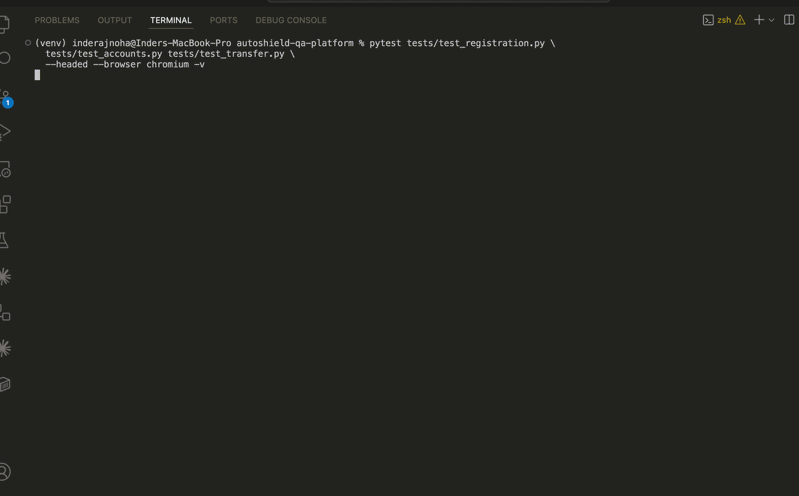

# AutoShield QA Platform

[](https://github.com/InderParmar/autoshield-qa-platform/actions/workflows/test_pipeline.yml)


A full-stack QA automation platform targeting [ParaBank](https://parabank.parasoft.com) — a demo banking application with a full UI and REST API. Built to demonstrate end-to-end test engineering across UI automation, API testing, BDD, CI/CD, and performance testing.



---

## Live Test Reports

| Browser | Report |
|---|---|
| Chromium | [report_ui_chromium.html](https://inderparmar.github.io/autoshield-qa-platform/chromium/report_ui_chromium.html) |
| Firefox | [report_ui_firefox.html](https://inderparmar.github.io/autoshield-qa-platform/firefox/report_ui_firefox.html) |
| WebKit | [report_ui_webkit.html](https://inderparmar.github.io/autoshield-qa-platform/webkit/report_ui_webkit.html) |
| API | [report_api.html](https://inderparmar.github.io/autoshield-qa-platform/api/report_api.html) |

**Dashboard:** [inderparmar.github.io/autoshield-qa-platform](https://inderparmar.github.io/autoshield-qa-platform/)

---

## Test Coverage

| Suite | Count | Location |
|---|---|---|
| UI Tests (Playwright + POM) | 17 | `tests/` |
| API Tests (pytest + requests) | 10 | `api_tests/` |
| BDD Tests (pytest-bdd 8.x) | 7 | `bdd/` |
| **Total** | **34** | |

All UI and BDD tests run against **3 browsers in parallel** (Chromium, Firefox, WebKit) on every push — **102 browser-test executions per CI run**.

---

## Tech Stack

| Layer | Tool |
|---|---|
| UI Automation | Playwright (Python) |
| Test Framework | pytest 8.x |
| BDD | pytest-bdd 8.1.0 + Gherkin |
| API Testing | requests + pytest |
| API Collection | Postman |
| Performance | Locust |
| CI/CD | GitHub Actions |
| Reporting | pytest-html + GitHub Pages |
| Config | configparser |

---

## Architecture

```
autoshield-qa-platform/
├── conftest.py                    # Root: browser, page, registered_user, base_url, test_data
├── pytest.ini                     # testpaths + --reruns 2 --reruns-delay 120
├── pages/                         # Page Object Model
│   ├── base_page.py
│   ├── login_page.py
│   ├── registration_page.py
│   ├── accounts_page.py
│   ├── transfer_page.py
│   └── bill_payment_page.py
├── tests/                         # UI test suite (17 tests)
│   ├── conftest.py                # logged_in_page fixture
│   ├── test_login.py
│   ├── test_registration.py
│   ├── test_accounts.py
│   ├── test_transfer.py
│   ├── test_bill_payment.py
│   └── test_e2e.py
├── api_tests/                     # API test suite (10 tests)
│   ├── conftest.py                # api_client, authenticated_session, account_ids
│   ├── api_utils/
│   │   └── api_helper.py          # ParaBankClient wrapper
│   ├── test_auth.py
│   ├── test_accounts_api.py
│   └── test_transactions_api.py
├── bdd/                           # BDD layer (7 tests)
│   ├── features/
│   │   ├── login.feature
│   │   ├── registration.feature
│   │   └── transfer.feature
│   └── steps/
│       ├── conftest.py
│       ├── test_login.py
│       ├── test_registration.py
│       └── test_transfer.py
├── performance/
│   └── locustfile.py              # Locust load test
├── postman/
│   ├── AutoShield _Collection.json
│   └── AutoShield_Environment.json
├── docs/
│   └── bug-reports/               # 7 documented ParaBank bugs
├── config/
│   ├── config.ini
│   └── config_reader.py
├── utils/
│   ├── logger.py
│   └── wait_helper.py
├── test_data/
│   ├── bill_payment_data.json
│   ├── login_data.json
│   ├── registration_data.json
│   └── transfer_data.json
├── reports/
│   ├── index.html                 # GitHub Pages landing page
│   ├── performance_report.html    # Locust baseline report
│   ├── logs/                      # Test run logs
│   └── screenshots/
└── .github/workflows/
    └── test_pipeline.yml
```

---

## CI/CD Pipeline

Two jobs run on every push to `main`:

```
push to main
    │
    ├── ui-bdd-tests [matrix: chromium, firefox, webkit]
    │       ├── runs tests/ + bdd/
    │       └── deploys HTML report → gh-pages/{browser}/
    │
    └── api-tests (runs after ui-bdd-tests)
            ├── runs api_tests/
            └── deploys report → gh-pages/api/ + index.html → root
```

- `continue-on-error: true` on test and deploy steps — a flaky test or push conflict does not fail the pipeline
- `keep_files: true` on all gh-pages deploys — browser reports coexist without overwriting each other
- Playwright installed in both jobs independently

---

## Setup

**Prerequisites:** Python 3.11+, pip

```bash
# Clone
git clone https://github.com/InderParmar/autoshield-qa-platform.git
cd autoshield-qa-platform

# Install dependencies
pip install -r requirements.txt

# Install Playwright browsers
playwright install
```

---

## Running Tests

### UI Tests (all browsers)
```bash
pytest tests/ --browser chromium --html=reports/report_ui.html
pytest tests/ --browser firefox  --html=reports/report_ui_firefox.html
pytest tests/ --browser webkit   --html=reports/report_ui_webkit.html
```

### API Tests
```bash
pytest api_tests/ --html=reports/report_api.html
```

### BDD Tests
```bash
pytest bdd/ --html=reports/report_bdd.html
```

### All Tests
```bash
pytest tests/ api_tests/ bdd/ --html=reports/report_full.html
```

### Performance Test (Locust)
```bash
locust --headless -u 50 -r 5 --run-time 60s \
  --html reports/performance_report.html \
  -f performance/locustfile.py \
  --host https://parabank.parasoft.com
```
> ⚠️ Do not increase beyond 50 users — ParaBank is a shared demo site.

---

## Performance Baseline

Run once against ParaBank with 50 concurrent users over 60 seconds:

| Metric | Result |
|---|---|
| Total Requests | 1,408 |
| Failure Rate | **0%** |
| Average Response Time | 83ms |
| Median (50th percentile) | 81ms |
| 95th Percentile | 92ms |
| Max Response Time | 422ms |
| Requests / Second | ~24 |

Endpoints tested: login (on_start), get accounts, get account details, get transactions.
Task weights: `viewAccounts` ×3, `getAccountDetails` ×2, `getTransactions` ×1 — reflecting real-world usage patterns.

Full report: [`reports/performance_report.html`](reports/performance_report.html)

---

## Bug Reports

Seven reproducible bugs documented in [`docs/bug-reports/`](docs/bug-reports/) across four categories:

| ID | Title | Severity |
|---|---|---|
| BUG-001 | REST API returns HTTP 400 instead of 401 for invalid credentials | Medium |
| BUG-002 | Account overview displays stale balance after fund transfer | Medium |
| BUG-003 | Fund transfer form accepts $0.00 as a valid amount | Medium |
| BUG-004 | Bill payment phone number field accepts non-numeric characters | Low |
| BUG-005 | Newly opened account not available in transfer dropdown immediately | Medium |
| BUG-006 | Sequential integer IDs enable IDOR (OWASP API1:2023) | High |
| BUG-007 | Authenticated pages accessible via back button after logout | Medium |

---

## Key Engineering Decisions

**`registered_user` fixture is session-scoped and registers via UI**
A unique username is generated per test session using a UUID suffix. After registration, the fixture waits explicitly for `select#fromAccountId option` to be present before opening a second account — skipping this wait causes a silent backend failure where the AJAX call completes but the account is not available to downstream tests.

**API tests run in a separate CI job**
Running the API test suite in the same job as the parallel browser matrix caused Cloudflare 429 rate-limiting errors. Separating it into a `needs: ui-bdd-tests` job resolved this entirely.

**pytest-bdd 8.x path resolution change**
`scenarios()` in pytest-bdd 8.x resolves paths relative to the test file, not the project root. All feature file paths are written as `"../features/login.feature"` from the steps directory.

**ParaBank returns 400 not 401 for invalid credentials**
Discovered during API test development. Both the pytest suite and Postman collection assert `400`, reflecting actual server behaviour rather than the HTTP specification. Documented as BUG-001.

**`--reruns 2 --reruns-delay 120` in pytest.ini**
ParaBank throttles sequential requests. A 120-second delay between retries allows the server to recover before the rerun executes. Transfer and BDD transfer tests are most susceptible.

---

## Known Limitations

- ParaBank is a shared public demo — test reliability depends on server availability
- `test_transfer_updates_account_balance` can fail intermittently on WebKit due to account balance caching (BUG-002) — accepted, not a code defect
- Firefox consistently passes 24/24; Chromium and WebKit occasionally pass 22–23/24
- Locust performance test is not included in CI — run manually as needed

---

## Author

**Inderpreet Singh Parmar**
QA Automation Engineer — Toronto, ON
[GitHub](https://github.com/InderParmar)
